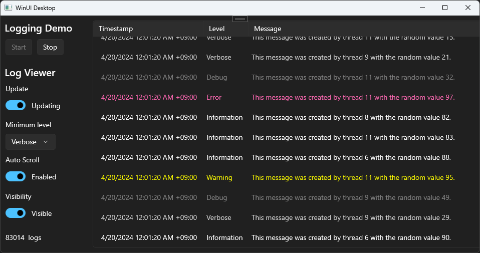

# 🧵 Serilog.Sinks.MemorySink

A [Serilog](https://github.com/serilog/serilog) sink that store log events in memory. You can retrieve these logs and render them in your own log viewer.

The sample app shows how to create a simple log viewer using WinUI 3.


✨**Getting started**

Install *Serilog.Sinks.MemorySink*:

```powershell
dotnet add package Serilog.Sinks.MemorySink
```

Create a logger configuration:

```cs
Log.Logger = new LoggerConfiguration()
    .WriteTo.MemorySink(out ILogSource<Serilog.Events.LogEvent> logSource)
    .CreateLogger();
```

Retrieve logs:

```cs
var logs = await logSource.GetLogs(startIndex, requiredCount, cancellationToken);
```

⚙️**Custom log item, options and exception handling**

To use a custom log item, you need to provide a log event converter:

```cs
public record LogItem(DateTimeOffset Timestamp, LogEventLevel Level, string Message);
```

```cs
Log.Logger = new LoggerConfiguration()
    .WriteTo.MemorySink(
        out ILogSource<LogItem> logSource,
        options =>
        {
            options.LogEventConverter = logEvent =>
            {
                return new LogItem(logEvent.Timestamp, logEvent.Level, logEvent.MessageTemplate.Text);
            };
            options.MaxLogsCount = 100_000;
            options.OnException = ex =>
            {
                // Handle sink processing exception.
            };
        })
        .CreateLogger();
```
